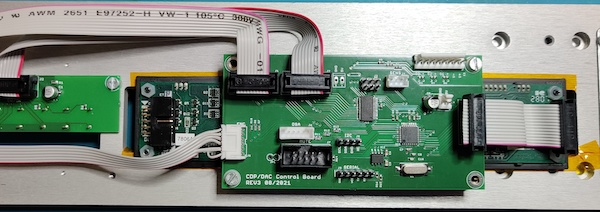

# CDP Firmware
A while back I cobbled together a custom control board around the [hifiakademie PreAmp](https://hifiakademie.de/?id=12.3&si=MTY2MjMxMTA4NC4yOTkzfDc5LjIxMy4yMjMuMjQ0fCA), which at the time was available as a DIY PCB option. Everything was built into the requisite modushop/hifi2000 case but I lacked the tooling/know-how to complete the plans for the front panel. The actual hifi functionality (switching relays and the PGA2311 volume control) did actually work though.

Fast-forward and I've also acquired the CDPro2LF+SRC4392+DSP+DAC by the same manufacturer (as well as some DSPs and additional poweramps). While the touchscreen that it comes with is great and the project isn't as DIY-friendly, I still have the milled front panel and VFD so it seemed like a "good idea" to build a new controller around that.



## Basics
Since I had a bunch of spare Atmega328p lying around that's what it ended up using to interface with
- DSA interface for the CD-Pro2LF (directly in REV3 instead of via the hifiakademie 10-pin port)
- I2C interface for the SRC4392 on the main board (\*)
- GU280x16 VFD (4-bit parallel interface)
- 5x illuminated switch for controls plus rotary encoder (via MCP23S17 IO expander)
- IR receiver (yeah, RC5 is obsolete but I like the remote)
- Serial port (isolated)
- 3 relays (5V/9V for the drive)
- Magnetic sensor for lid open/close

(\*) Slightly risky because that runs at 3.3V

## Secondary Goals
- Experiments with "low-level stuff" on AVR with C++. Yes, there are existing projects (modm.io or avril) that already do this, but "learning by f\*ck up" is pretty effective :)
- There's a smaller control board for a power amplifier standby using a attiny85 that will also be integrated.
- Ultimately I expect the serial port to interface with some kind of digital media player (e.g. a Pi) since there are multiple inputs available on the DAC board.

## Status
- It's very much in the "wow the boards actually work" bringup phase, but it can actually play a CD.
- But there are quite a few open questions (e.g. menu structure) as well as "details" like supporting the other SRC inputs and ensuring things.

## Build
- Main makefiles are in the `cdp_control` and (stubby) `amp_control` directories, with the shared AVR stuff in `avrx`. Assuming a recent `avr-gcc` is in the path that Should Work but can be modified using `TOOLCHAIN_PATH`.
- The project can also be built using docker (see `docker` directory) but since that can't follow symlinks, it needs to be run from the main directory:
```
docker run --rm -it -v $(pwd):/build pld/avr make -C amp_control
```
- I still use an ancient STK500v2 for uploading :) The type of interface and some parameters like tty port can be set using `PROGRAMMER` and `PROGAMMER_PORT` environment variables (I often use `direnv` with a suitable `.envrc`).

## Notes/Additional Licenses
- IR decoding provided by [IRMP](https://github.com/Mikrocontroller-net/irmp)
